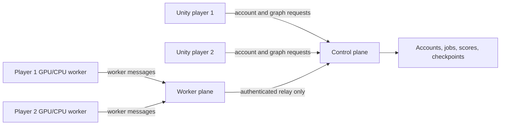

# LearnAIUI deployment and running guide

This guide explains how to download, configure, run, test, and distribute the
complete LearnAIUI project. It covers the Python server, the Unity source
project, the optional player compute worker, and compiled Windows players.

## 1. Understand the project layout

The GitHub repository uses two branches for two parts of the same system:

| Branch | Purpose | Who needs it? |
| --- | --- | --- |
| [`main`](https://github.com/DKpro000/LearnAIUI/tree/main) | Unity frontend | Unity developers |
| [`backend`](https://github.com/DKpro000/LearnAIUI/tree/backend) | Python API, training, leaderboard, and scheduler | Server owner |

Normal players do not need either source branch. They should receive a compiled
Windows game ZIP. A friend opening the Unity source needs the `main` branch and
does not need to install Python or a worker folder manually. Unity downloads
the selected worker from [GitHub Releases](https://github.com/DKpro000/LearnAIUI/releases)
after login.
Only the computer hosting the server needs Python and the `backend` branch.



The two planes are modules inside the same Python server process and use the
same port. Only the control plane opens or changes the databases. It validates
Unity requests before recording jobs and is the only component that assigns a
validated job to a worker. The worker plane never opens the database; it only
authenticates worker traffic and delegates state changes to the control plane.

Compute behavior:

- With zero or one active player worker, the server trains the model.
- With two or more active workers owned by different players, jobs can be
  trained by player computers.
- Each worker trains one complete model; one model is not divided between PCs.
- Final evaluation and leaderboard scoring always run on the server.

## 2. Requirements

### Server computer

- Windows 10 or 11
- 64-bit Python with `pip`
- Git, or the ability to download a GitHub branch as a ZIP
- Enough free disk space for Python packages, datasets, and checkpoints
- A GPU is optional; CPU server training is supported but is slower

### Unity developer computer

- Unity Hub
- Unity Editor `6000.5.3f1`
- Windows Build Support if creating a Windows player
- Git, or the Unity branch ZIP
- Network access to the worker manifest if this PC should contribute compute

### Normal player computer

- Windows 10 or 11
- The complete compiled game folder
- Network access to the server
- No Python, Unity, CUDA, or NVIDIA GPU is required

The Windows game contains its own worker runtime. On launch, that worker tests
whether its CUDA-enabled PyTorch package can really allocate a tensor on an
NVIDIA GPU. It uses `cuda:0` when the test succeeds and CPU otherwise. AMD and
Intel graphics currently fall back to CPU. A player never installs or starts
Python or the CUDA toolkit.

## 3. Deploy the Python server

Perform this section only on the computer that will host the server.

### 3.1 Download the backend branch

Using Git:

```powershell
git clone --branch backend --single-branch `
  https://github.com/DKpro000/LearnAIUI.git `
  LearnAIUI-Backend
cd LearnAIUI-Backend
```

Alternatively, download the `backend` branch ZIP from GitHub, extract it, and
open PowerShell in the extracted folder.

### 3.2 Create the Python environment

These commands use the environment's Python directly, so activation is not
required:

```powershell
py -m venv .venv
.\.venv\Scripts\python.exe -m pip install --upgrade pip
.\.venv\Scripts\python.exe -m pip install -r requirements.txt
```

The first installation is large because it includes PyTorch. If PyTorch cannot
be installed, confirm that Python is 64-bit and install the server's CPU or CUDA
PyTorch build using the official PyTorch installation instructions.

***Note***: If your computer contains cuda(GPU), run the following steps to 
download pytorch cuda version:
```powershell
pip uninstall -y torch torchvision torchaudio
pip cache purge
pip install torch torchvision torchaudio --index-url https://download.pytorch.org/whl/cu128'
```

### 3.3 Create the account-session secret once

`PLAYER_TOKEN_PEPPER` is a private server secret used to hash account session
tokens. Create it yourself once and
reuse exactly the same value for every future server start. This command also
works on older PowerShell/.NET versions where
`RandomNumberGenerator.Fill()` is unavailable:

```powershell
$bytes = New-Object byte[] 48
$rng = [System.Security.Cryptography.RandomNumberGenerator]::Create()
try {
    $rng.GetBytes($bytes)
} finally {
    $rng.Dispose()
}
$pepper = [Convert]::ToBase64String($bytes)
$pepper
```

Copy the printed value into a password manager. Do not commit it, post it in
Discord, or send it to players.

For the current PowerShell window, configure the server with the generated
value:

```powershell
$env:SERVER_DATA_DIR = "C:\NNBuilderData"
$env:PLAYER_TOKEN_PEPPER = "PASTE-YOUR-GENERATED-SECRET-HERE"
```

`$env:` settings last only for the current PowerShell process. Every new server
terminal must receive the same values. To make them persistent for the current
Windows user, run the following once, then open a new PowerShell window:

```powershell
[Environment]::SetEnvironmentVariable(
    "SERVER_DATA_DIR",
    "C:\NNBuilderData",
    "User"
)
[Environment]::SetEnvironmentVariable(
    "PLAYER_TOKEN_PEPPER",
    "PASTE-YOUR-GENERATED-SECRET-HERE",
    "User"
)
```

Changing the pepper makes every previously issued Unity account session invalid.
Changing `SERVER_DATA_DIR` points the server at a different leaderboard and
worker database. Restore the original values if existing identities and scores
must remain accessible.

### 3.4 Start the server

From the backend folder:

```powershell
.\.venv\Scripts\python.exe -m uvicorn app:app `
  --host 0.0.0.0 `
  --port 8000 `
  --workers 1
```

Keep this PowerShell window open. Use exactly one Uvicorn worker because the
application contains its own training fallback queue.

Test locally in another PowerShell window:

```powershell
Invoke-RestMethod http://127.0.0.1:8000/
```

A correct response includes:

```text
success : True
message : Neural Network Builder backend is running.
```

### 3.5 Find the server's LAN address

Run:

```powershell
ipconfig
```

Find the IPv4 address under the active Wi-Fi or Ethernet adapter, for example
`192.168.1.20`. Do not give players `127.0.0.1`; that address always means the
player's own computer.

Players on the same LAN will use:

```text
http://192.168.1.20:8000
```

### 3.6 Allow the server through Windows Firewall

First accept the Windows firewall prompt for Python on private networks. If the
prompt does not appear, an administrator can open PowerShell and run:

```powershell
New-NetFirewallRule `
  -DisplayName "LearnAIUI server" `
  -Direction Inbound `
  -Protocol TCP `
  -LocalPort 8000 `
  -Action Allow `
  -Profile Private
```

From another computer on the same network, open this URL in a browser:

```text
http://SERVER-IP:8000/
```

Do not expose a plain Uvicorn port directly to the public internet. For remote
internet players, use HTTPS behind a reverse proxy or use a trusted private VPN.

## 4. Open and configure the Unity source project

### 4.1 Download the Unity branch

Using Git:

```powershell
git clone --branch main --single-branch `
  https://github.com/DKpro000/LearnAIUI.git `
  LearnAIUI-Unity
```

Alternatively, download and extract the `main` branch ZIP.

In Unity Hub:

1. Select **Add > Add project from disk**.
2. Select the extracted `LearnAIUI-Unity` folder.
3. Open it with Unity `6000.5.3f1`.
4. Wait for packages and scripts to finish importing.
5. Open `Assets/Scenes/SampleScene.unity` if it is not already open.

Do not copy another person's `Library`, `Temp`, `Obj`, or `UserSettings` folder.
Unity generates those folders locally.

### 4.2 Configure the automatic compute worker

No worker folder is required under `Assets/StreamingAssets`. The
`GraphBackendClient` default manifest is:

```text
https://github.com/DKpro000/LearnAIUI/releases/download/worker-v2026.07.19/NNBuilderWorker-manifest.json
```

After account login, Unity performs this workflow automatically:

1. Windows is checked for the NVIDIA CUDA driver library, `nvcuda.dll`.
2. NVIDIA computers select the CUDA package; other computers select CPU.
3. Unity downloads every package part from the URLs in the manifest.
4. Every part and the reconstructed ZIP are verified with SHA-256.
5. The ZIP is safely extracted under Unity's `persistentDataPath`.
6. The cached worker is reused on later launches.
7. If the CUDA package cannot be installed, Unity tries the CPU package.

The Python worker then performs a real CUDA tensor-allocation test. A usable
NVIDIA GPU trains on `cuda:0`; otherwise training uses CPU. Players never
install or launch Python or the CUDA toolkit themselves. AMD and Intel GPUs use
the CPU worker in the current release.

For a private or test worker release, change **Worker Manifest Url** on
`GraphBackendClient`, or put `workerManifestUrl` in `server-config.json`. Use
HTTPS except for a `localhost` development test.

### 4.3 Configure the server URL in Unity

For testing on the server computer, `http://127.0.0.1:8000` is valid. For every
other computer, use the server's real LAN address.

In `SampleScene`:

1. Select the `BackEndManager` GameObject.
2. In `GraphBackendClient`, set **Backend Url** to
   `http://SERVER-IP:8000`.
3. In `NodeLibraryClient`, set **Backend Url** to the same value.
4. Save the scene.

Both components must use the same address. If only `GraphBackendClient` is
changed, training may work while loading the node library still tries the local
computer.

### 4.4 First Unity test

1. Confirm the Python server is running.
2. Enter Play mode.
3. The login view appears with only **Email address** and **Password**. For a
   new account, select **Need an account? Register**.
4. The registration view requires **Email address**, **Display name**,
   **Password**, and **Confirm password**. The two password values must match;
   passwords contain 10-128 characters.
5. On another run or computer, log in with only the same email and password.
   Email matching is case-insensitive. Unity stores only the returned revocable
   session token; it never saves either password field.
6. If automatic compute contribution is enabled,
   Unity downloads it once and `NNBuilderWorker.exe` starts invisibly.
   It automatically selects an NVIDIA GPU when available or CPU otherwise.
7. Build a small valid graph and train it with one epoch first.
8. Confirm that the result appears in Unity and the server terminal receives
   requests.

The account gate is created by code at runtime; no login Canvas or prefab must
be added to the scene. Use the **Account** button in the upper-right corner to
view the signed-in account or log out. Validation, training, checkpoints, final
evaluation, leaderboard access, and compute contribution wait until login.
The current server uses email as the unique login identifier but does not send
verification or password-reset emails.

The worker downloads MNIST, FashionMNIST, or CIFAR10 when needed for the first
time. This can make the first training attempt slower.

Player and worker state is stored under Unity's `persistentDataPath`. On the
current Windows project this is normally under:

```text
%USERPROFILE%\AppData\LocalLow\DefaultCompany\My project
```

The worker log is inside the `compute-worker-runtime` subfolder.
Downloaded worker packages are installed under the neighboring
`compute-worker-packages` subfolder. The first CUDA installation needs enough
temporary space for both the downloaded archive parts and the extracted worker.

## 5. Build and distribute the Windows game

Only the project owner/developer performs this section. Normal players do not
build the project.

### 5.1 Before building

Confirm all of the following:

- Unity uses `6000.5.3f1` with Windows Build Support.
- The worker GitHub Release is published and its manifest URL opens correctly.
- `Assets/StreamingAssets/ComputeWorker` is absent for a manual build. If a
  developer-only copy exists, use the automated backend build script, which
  temporarily moves and restores it.
- Both backend URL fields in `BackEndManager` use the intended server.
- The scene is saved and included in the active Build Profile.
- `automaticallyContributeCompute` is enabled only if players have been informed
  that the game can use GPU or CPU, memory, storage, electricity, and network
  traffic.

### 5.2 Manual Windows build

A manual Unity build includes everything under `StreamingAssets`. Therefore do
not build manually while a developer-only `Assets/StreamingAssets/ComputeWorker`
folder exists, or the game will still be several gigabytes. The recommended
`build_unity_windows.ps1` flow handles this automatically. If you choose a
manual build, close Unity, move that entire folder outside `Assets`, reopen
Unity, build, then restore the folder for local development.

1. Open **File > Build Profiles**.
2. Select or add **Windows**.
3. Choose the `x86_64` architecture.
4. Add `Assets/Scenes/SampleScene.unity` to the scene list.
5. Select **Build**.
6. Build into a new folder such as `Builds/NNBuilder`.

The folder must contain the game executable and its supporting folders. Do not
send only the `.exe`.

Create `server-config.json` beside the compiled `.exe`:

```json
{
  "serverUrl": "http://192.168.1.20:8000",
  "workerManifestUrl": "https://github.com/DKpro000/LearnAIUI/releases/download/worker-v2026.07.19/NNBuilderWorker-manifest.json"
}
```

Replace the example IP with the real server address. The command-line option
`--server-url` has priority over this file, and this file has priority over the
`GraphBackendClient` Inspector value.

The repository also contains `build_unity_windows.ps1` on the backend branch.
Before using it, check that its `$UnityExe` path points to the installed Unity
version. The project currently requires `6000.5.3f1`.

### 5.3 Create the player download

Zip the entire build directory:

```text
NNBuilder/
├── NNBuilder.exe
├── NNBuilder_Data/
├── MonoBleedingEdge/        (when produced by Unity)
├── UnityPlayer.dll          (when produced by Unity)
└── server-config.json
```

Upload that ZIP as a GitHub Release asset. Players extract the entire ZIP and
launch `NNBuilder.exe`. They do not install Python or Unity.

## 6. Create and upload an automatic worker Release

Only the maintainer performs this section. Normal Unity developers and players
receive workers automatically after login.

### 6.1 Prepare CPU and CUDA Python environments

From the backend folder, create the CPU packaging environment:

```powershell
py -m venv .worker-venv
.\.worker-venv\Scripts\python.exe -m pip install --upgrade pip
.\.worker-venv\Scripts\python.exe -m pip install `
  --index-url https://download.pytorch.org/whl/cpu `
  torch torchvision
.\.worker-venv\Scripts\python.exe -m pip install numpy pandas pyinstaller
```

The CUDA environment must contain a CUDA-enabled PyTorch build plus `numpy`,
`pandas`, and `pyinstaller`. On the current server computer this is `.venv`.
Verify it before packaging:

```powershell
.\.venv\Scripts\python.exe -c `
  "import torch; print(torch.__version__, torch.version.cuda)"
```

The second printed value must be a CUDA version rather than `None`.

### 6.2 Build the release catalog

Choose one version and matching release tag. Increase it whenever worker code
or Python dependencies change:

```powershell
.\package_worker_catalog.ps1 `
  -Version "2026.07.19" `
  -ReleaseTag "worker-v2026.07.19" `
  -Repository "DKpro000/LearnAIUI" `
  -UnityProjectPath "D:\folders\Unity\Unity_Prj\My project" `
  -CpuPythonPath ".\.worker-venv\Scripts\python.exe" `
  -CudaPythonPath ".\.venv\Scripts\python.exe"
```

This builds the variants one at a time, compresses each folder, and splits an
archive larger than 1,400 MB into `.part001`, `.part002`, and later assets. It
generates:

```text
backend/release/NNBuilderWorker-manifest.json
backend/release/NNBuilderWorker-manifest.json.sha256.txt
backend/release/NNBuilderWorker-Windows-x64-cpu-VERSION.zip
backend/release/NNBuilderWorker-Windows-x64-cuda-VERSION.zip.part001
backend/release/NNBuilderWorker-Windows-x64-cuda-VERSION.zip.part002
...and a .sha256.txt beside every uploaded ZIP or part
```

The exact number of CUDA parts depends on compression. The manifest records
each filename, GitHub URL, size, and hash. Never rename an asset after creating
the manifest.

Test the most recently built executable before publishing:

```powershell
.\worker-dist\NNBuilderWorker\NNBuilderWorker.exe `
  --diagnose-device `
  --log-file .\worker-device.log
Get-Content .\worker-device.log
```

### 6.3 Upload through the GitHub website

1. Open <https://github.com/DKpro000/LearnAIUI/releases>.
2. Select **Draft a new release**.
3. Select **Choose a tag**, enter the exact tag from `-ReleaseTag`, and create
   it, for example `worker-v2026.07.19`.
4. Set a title such as `NNBuilder worker 2026.07.19`.
5. From `backend/release`, upload:
   - `NNBuilderWorker-manifest.json`;
   - every CPU ZIP/part; and
   - every CUDA ZIP/part.
6. Upload exactly the filenames in `worker-release-assets.txt`. Do not upload
   package descriptors, separate checksum files, logical archive checksums, or
   old ZIPs that are absent from that list. Unity verifies the hashes embedded
   in the manifest, so those separate checksum assets are unnecessary.
7. Wait until every progress bar finishes, then select **Publish release**.
8. Verify the tag-specific manifest in a browser. Do not use
   `releases/latest`, because publishing a newer game release would redirect it
   away from the worker release:

```text
https://github.com/DKpro000/LearnAIUI/releases/download/worker-v2026.07.19/NNBuilderWorker-manifest.json
```

If GitHub shows `Something went really wrong` in the browser, use GitHub CLI.
To reduce the CUDA archive to the minimum two parts without rebuilding PyTorch,
run:

```powershell
powershell.exe -NoProfile -ExecutionPolicy Bypass `
  -File .\repartition_worker_release.ps1 `
  -TorchVariant Cuda `
  -PartSizeMB 1400
```

This updates the CUDA parts, their local checksums, the manifest, and
`worker-release-assets.txt`. Upload the new list; do not mix old parts or an old
manifest with the regenerated files.

### 6.4 Upload with GitHub CLI instead

Install and authenticate `gh`, then run:

```powershell
$assets = Get-Content .\release\worker-release-assets.txt |
  ForEach-Object { Join-Path (Resolve-Path .\release) $_ }

gh release create "worker-v2026.07.19" $assets `
  --repo "DKpro000/LearnAIUI" `
  --title "NNBuilder worker 2026.07.19" `
  --notes "Automatic CPU/CUDA compute worker release."
```

If the draft already exists, replace its assets instead:

```powershell
gh release upload "worker-v2026.07.19" $assets `
  --repo "DKpro000/LearnAIUI" `
  --clobber
```

After verifying the four assets, publish the draft:

```powershell
gh release edit "worker-v2026.07.19" `
  --repo "DKpro000/LearnAIUI" `
  --draft=false
```

### 6.5 Push the source-code changes

The worker Release assets and source commits are separate uploads. From the
backend working copy, review the changes and push them to the `backend` branch:

```powershell
git status --short
git add README.md compute_worker.py build_worker.ps1 `
  build_unity_windows.ps1 package_worker_release.ps1 `
  package_worker_catalog.ps1 repartition_worker_release.ps1 `
  tests/test_compute_worker.py
git commit -m "Add automatic CPU and CUDA worker delivery"
git push origin HEAD:backend
```

From the Unity working copy, push only the Unity source and documentation to
the `main` branch:

```powershell
git status --short
git add `
  Assets/Scripts/NodeEditor/Backend/ComputeWorkerInstaller.cs `
  Assets/Scripts/NodeEditor/Backend/ComputeWorkerInstaller.cs.meta `
  Assets/Scripts/NodeEditor/Backend/GraphBackendClient.cs `
  Assets/Scripts/NodeEditor/Data/GraphExportModels.cs `
  README.md
git commit -m "Download the appropriate compute worker automatically"
git push origin HEAD:main
```

Check `git status` before committing. Never use `git add .` while a generated
`Assets/StreamingAssets/ComputeWorker` folder, secret, database, or release
archive might be present.

The source branches contain only launcher and packaging code. Worker binaries,
release parts, account secrets, and generated databases must not be committed.

## 7. Updating an existing installation

### Server update

1. Stop the server with `Ctrl+C`.
2. Back up `C:\NNBuilderData`.
3. Back up the backend `saved_models` folder if the default runtime path is in
   use.
4. Pull or download the new `backend` branch.
5. Run the requirements installation again.
6. Start the server with the same pepper and data directory.

```powershell
git pull
.\.venv\Scripts\python.exe -m pip install -r requirements.txt
```

On first startup, the server automatically adds the formal account/session
tables and validated-job fields to existing SQLite databases. Back up the data
directory first. Old anonymous player tokens are intentionally not accepted as
formal account sessions; each player must register an email/password account.
Existing public scores remain readable, but an old anonymous score is not
automatically transferred to a new account.

An account created by the earlier username-based login version has no email
that can be inferred safely. Its currently saved session remains usable, but
after logout the player must create an email-based account unless the server
administrator performs a deliberate migration.

### Reinitialize the server databases

Reinitialization is not required when upgrading: the server migrates existing
SQLite files automatically. Use this procedure only when a completely fresh
set of accounts, sessions, leaderboard scores, workers, and training jobs is
intended.

First stop Uvicorn with `Ctrl+C`. Never move database files while the server is
running. Check whether explicit database paths override `SERVER_DATA_DIR`:

```powershell
Get-Item `
  Env:SERVER_DATA_DIR, `
  Env:LEADERBOARD_DB_PATH, `
  Env:COMPUTE_DB_PATH `
  -ErrorAction SilentlyContinue
```

For the standard `C:\NNBuilderData` deployment, rename the entire directory as
a recoverable backup and create an empty replacement:

```powershell
$stamp = Get-Date -Format "yyyyMMdd-HHmmss"

Move-Item `
  -LiteralPath "C:\NNBuilderData" `
  -Destination "C:\NNBuilderData-backup-$stamp"

New-Item -ItemType Directory -Path "C:\NNBuilderData"
```

Then restart the backend with the existing secret:

```powershell
$env:SERVER_DATA_DIR = "C:\NNBuilderData"
$env:PLAYER_TOKEN_PEPPER = "PASTE-YOUR-EXISTING-SECRET-HERE"

.\.venv\Scripts\python.exe -m uvicorn app:app `
  --host 0.0.0.0 `
  --port 8000 `
  --workers 1
```

The control plane creates fresh `leaderboard.db` and `compute.db` files. Saved
Unity sessions then receive `401 Unauthorized`; Unity clears the stale token
and returns the player to the login/register screen. Every player must create a
new email-based account.

If `LEADERBOARD_DB_PATH` or `COMPUTE_DB_PATH` is shown by the environment check,
those exact files are outside or independent of the standard directory and
must be backed up separately. Renaming the data directory does not reset a
database whose explicit path points elsewhere. The `saved_models` directory is
also separate and is not deleted by this database reset.

### Unity source update

1. Exit Play mode and close Unity.
2. Pull or download the new `main` branch.
3. Reopen it using the recorded Unity version.
4. Let Unity reimport scripts and packages.
5. Confirm both server URL fields again.

Worker binaries are ignored by Git. A source pull does not install them; Unity
checks the release manifest after login and caches the selected version.

## 8. Troubleshooting

### `WinError 126` or `torch_cpu.dll` could not be loaded

The cached worker is incomplete or a required Microsoft runtime is unavailable.

1. Close Unity or the compiled game.
2. Delete only this generated cache directory:

   ```text
   %USERPROFILE%\AppData\LocalLow\DefaultCompany\My project\compute-worker-packages
   ```

3. Launch Unity and log in. It downloads and verifies the worker again.
4. Check that the manifest URL opens in a browser and that GitHub has every part
   named by the manifest.
5. If the error remains, install the current Microsoft Visual C++ x64
   Redistributable and restart Windows.

Do not delete `compute-worker-runtime` unless downloaded datasets and worker
logs should also be removed.

### `401 Unauthorized: Invalid player token`

The saved account session expired, was logged out, or no longer matches the
server database and `PLAYER_TOKEN_PEPPER`. Restore the original pepper and
`SERVER_DATA_DIR` if the change was accidental. Otherwise Unity clears the
stale local session and shows the login/register screen. Log in with the
existing email and password; Unity does not silently create another account.

### `422 Unprocessable Entity`

The server received the request but rejected the graph or training settings.
Read the JSON error body printed in the Unity Console. Common causes include:

- disconnected or unsupported nodes;
- incompatible tensor shapes;
- output class count not matching the selected dataset;
- excessive node, parameter, epoch, batch, or input limits; or
- an unsupported dataset name.

### Unity cannot connect to the server

Check these items in order:

1. The server PowerShell window is still running.
2. `http://127.0.0.1:8000/` works on the server PC.
3. `http://SERVER-IP:8000/` works from the player PC's browser.
4. Both Unity backend URL fields use the server IP, not `127.0.0.1`.
5. Windows Firewall permits inbound private-network TCP port `8000`.
6. Both computers are on the same LAN or connected through the intended VPN.

### Node library fails but another backend request works

Select `BackEndManager` and confirm that both `NodeLibraryClient` and
`GraphBackendClient` use the same server URL.

### Worker is not contributing compute

- Confirm that the manifest URL opens and all named GitHub assets exist.
- Confirm that `automaticallyContributeCompute` is enabled.
- Check `compute-worker-runtime/compute-worker.log`.
- The log's `Training device` line reports `cuda:0` or `cpu`. A CPU selection
  includes a fallback reason when CUDA is unavailable or its probe fails.
- Open `http://SERVER-IP:8000/worker-plane/status`, or inspect the server logs.
- Remember that distributed training is selected only when at least two active
  workers belong to different players. Otherwise, server training is expected.

## 9. Data and leaderboard notes

Built-in worker datasets:

- MNIST
- FashionMNIST
- CIFAR10

Server-only local datasets included by the current backend code:

- ChihuahuaMuffin
- Titanic
- WeatherPrediction

A player worker advertises a local dataset only when the matching dataset folder
is installed under its `compute-worker-runtime/dataset` directory. Jobs are not
sent to workers that report they do not support the selected dataset.

Leaderboard scores are grouped by dataset and `LEADERBOARD_SEASON`. Change the
season when the evaluation data, preprocessing, or scoring rules change. Final
F1 evaluation is performed by the server, not accepted directly from a player.

## 10. Security and release checklist

Never commit or distribute:

- `PLAYER_TOKEN_PEPPER`;
- `.env` or `secret.txt`;
- `compute-worker.json`;
- leaderboard or worker database files;
- player or worker tokens; or
- a private server URL containing credentials.

Passwords are salted and hashed on the server, but a plain HTTP LAN connection
does not encrypt traffic. Use HTTPS or a trusted private VPN for internet play.

Before sharing a release:

- [ ] The server responds locally and from a second computer.
- [ ] The same pepper and data directory will be reused after restart.
- [ ] Both Unity backend URL fields point to the correct server.
- [ ] The CPU/CUDA worker Release and manifest are published on GitHub.
- [ ] The tag-specific manifest URL opens and every listed asset downloads.
- [ ] The compiled game contains its full `_Data` and library folders.
- [ ] `server-config.json` is beside the game executable.
- [ ] A one-epoch training test succeeds.
- [ ] Final evaluation submits a server-verified F1 score.
- [ ] The leaderboard is visible from another player.
- [ ] Players are informed about automatic compute contribution and can receive
      a non-contributing build if required.
