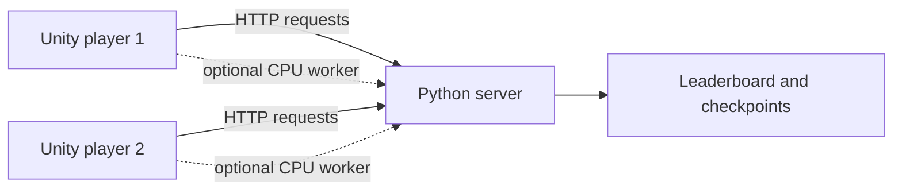

# LearnAIUI deployment and running guide

This guide explains how to download, configure, run, test, and distribute the
complete LearnAIUI project. It covers the Python server, the Unity source
project, the optional player compute worker, and compiled Windows players.

## 1. Understand the project layout

The GitHub repository uses two branches for two parts of the same system:

| Branch | Purpose | Who needs it? |
| --- | --- | --- |
| [`main`](https://github.com/DKpro000/LearnAIUI/tree/main) | Unity frontend | Unity developers |
| [`backend`](https://github.com/DKpro000/LearnAIUI/tree/backend) | Python API, training, leaderboard, and scheduler | Server owner |

Normal players do not need either source branch. They should receive a compiled
Windows game ZIP. A friend opening the Unity source needs the `main` branch and
the worker ZIP from [GitHub Releases](https://github.com/DKpro000/LearnAIUI/releases).
Only the computer hosting the server needs Python and the `backend` branch.



Compute behavior:

- With zero or one active player worker, the server trains the model.
- With two or more active workers owned by different players, jobs can be
  trained by player computers.
- Each worker trains one complete model; one model is not divided between PCs.
- Final evaluation and leaderboard scoring always run on the server.

## 2. Requirements

### Server computer

- Windows 10 or 11
- 64-bit Python with `pip`
- Git, or the ability to download a GitHub branch as a ZIP
- Enough free disk space for Python packages, datasets, and checkpoints
- A GPU is optional; CPU server training is supported but is slower

### Unity developer computer

- Unity Hub
- Unity Editor `6000.5.3f1`
- Windows Build Support if creating a Windows player
- Git, or the Unity branch ZIP
- The prebuilt `NNBuilderWorker-Windows-x64.zip` release asset if this PC should
  contribute compute

### Normal player computer

- Windows 10 or 11
- The complete compiled game folder
- Network access to the server
- No Python, Unity, CUDA, or NVIDIA GPU is required

## 3. Deploy the Python server

Perform this section only on the computer that will host the server.

### 3.1 Download the backend branch

Using Git:

```powershell
git clone --branch backend --single-branch `
  https://github.com/DKpro000/LearnAIUI.git `
  LearnAIUI-Backend
cd LearnAIUI-Backend
```

Alternatively, download the `backend` branch ZIP from GitHub, extract it, and
open PowerShell in the extracted folder.

### 3.2 Create the Python environment

These commands use the environment's Python directly, so activation is not
required:

```powershell
py -m venv .venv
.\.venv\Scripts\python.exe -m pip install --upgrade pip
.\.venv\Scripts\python.exe -m pip install -r requirements.txt
```

The first installation is large because it includes PyTorch. If PyTorch cannot
be installed, confirm that Python is 64-bit and install the server's CPU or CUDA
PyTorch build using the official PyTorch installation instructions.

***Note***: If your computer contains cuda(GPU), run the following steps to 
download pytorch cuda version:
```powershell
pip uninstall -y torch torchvision torchaudio
pip cache purge
pip install torch torchvision torchaudio --index-url https://download.pytorch.org/whl/cu128'
```

### 3.3 Create the player-token secret once

`PLAYER_TOKEN_PEPPER` is a private server secret. Create it yourself once and
reuse exactly the same value for every future server start. This command also
works on older PowerShell/.NET versions where
`RandomNumberGenerator.Fill()` is unavailable:

```powershell
$bytes = New-Object byte[] 48
$rng = [System.Security.Cryptography.RandomNumberGenerator]::Create()
try {
    $rng.GetBytes($bytes)
} finally {
    $rng.Dispose()
}
$pepper = [Convert]::ToBase64String($bytes)
$pepper
```

Copy the printed value into a password manager. Do not commit it, post it in
Discord, or send it to players.

For the current PowerShell window, configure the server with the generated
value:

```powershell
$env:SERVER_DATA_DIR = "C:\NNBuilderData"
$env:PLAYER_TOKEN_PEPPER = "PASTE-YOUR-GENERATED-SECRET-HERE"
```

`$env:` settings last only for the current PowerShell process. Every new server
terminal must receive the same values. To make them persistent for the current
Windows user, run the following once, then open a new PowerShell window:

```powershell
[Environment]::SetEnvironmentVariable(
    "SERVER_DATA_DIR",
    "C:\NNBuilderData",
    "User"
)
[Environment]::SetEnvironmentVariable(
    "PLAYER_TOKEN_PEPPER",
    "PASTE-YOUR-GENERATED-SECRET-HERE",
    "User"
)
```

Changing the pepper makes every previously issued Unity player token invalid.
Changing `SERVER_DATA_DIR` points the server at a different leaderboard and
worker database. Restore the original values if existing identities and scores
must remain accessible.

### 3.4 Start the server

From the backend folder:

```powershell
.\.venv\Scripts\python.exe -m uvicorn app:app `
  --host 0.0.0.0 `
  --port 8000 `
  --workers 1
```

Keep this PowerShell window open. Use exactly one Uvicorn worker because the
application contains its own training fallback queue.

Test locally in another PowerShell window:

```powershell
Invoke-RestMethod http://127.0.0.1:8000/
```

A correct response includes:

```text
success : True
message : Neural Network Builder backend is running.
```

### 3.5 Find the server's LAN address

Run:

```powershell
ipconfig
```

Find the IPv4 address under the active Wi-Fi or Ethernet adapter, for example
`192.168.1.20`. Do not give players `127.0.0.1`; that address always means the
player's own computer.

Players on the same LAN will use:

```text
http://192.168.1.20:8000
```

### 3.6 Allow the server through Windows Firewall

First accept the Windows firewall prompt for Python on private networks. If the
prompt does not appear, an administrator can open PowerShell and run:

```powershell
New-NetFirewallRule `
  -DisplayName "LearnAIUI server" `
  -Direction Inbound `
  -Protocol TCP `
  -LocalPort 8000 `
  -Action Allow `
  -Profile Private
```

From another computer on the same network, open this URL in a browser:

```text
http://SERVER-IP:8000/
```

Do not expose a plain Uvicorn port directly to the public internet. For remote
internet players, use HTTPS behind a reverse proxy or use a trusted private VPN.

## 4. Open and configure the Unity source project

### 4.1 Download the Unity branch

Using Git:

```powershell
git clone --branch main --single-branch `
  https://github.com/DKpro000/LearnAIUI.git `
  LearnAIUI-Unity
```

Alternatively, download and extract the `main` branch ZIP.

In Unity Hub:

1. Select **Add > Add project from disk**.
2. Select the extracted `LearnAIUI-Unity` folder.
3. Open it with Unity `6000.5.3f1`.
4. Wait for packages and scripts to finish importing.
5. Open `Assets/Scenes/SampleScene.unity` if it is not already open.
6. Go to **Window > Package Management > Package Manager > press "+" button > Install package by technical name > Enter "com.unity.nuget.newtonsoft-json" and install package**

Do not copy another person's `Library`, `Temp`, `Obj`, or `UserSettings` folder.
Unity generates those folders locally.

### 4.2 Install the prebuilt compute worker

This step is optional for opening the editor, but required if this Unity PC
should contribute computing power.

1. Open [GitHub Releases](https://github.com/DKpro000/LearnAIUI/releases).
2. Download `NNBuilderWorker-Windows-x64.zip`.
3. Delete any incomplete `Assets/StreamingAssets/ComputeWorker` folder.
4. Extract the ZIP into `Assets/StreamingAssets`.
5. Wait for Unity to import the files.

The final paths must be:

```text
Assets/StreamingAssets/ComputeWorker/NNBuilderWorker.exe
Assets/StreamingAssets/ComputeWorker/_internal/torch/lib/torch_cpu.dll
```

`torch_cpu.dll` should be `305,081,856` bytes for the current worker release.
Do not commit the generated `ComputeWorker` folder to ordinary Git. It is
distributed as a GitHub Release because the DLL exceeds normal Git file limits.

The checksum file from the Release is optional. It remains beside the downloaded
ZIP and is not extracted into Unity.

### 4.3 Configure the server URL in Unity

For testing on the server computer, `http://127.0.0.1:8000` is valid. For every
other computer, use the server's real LAN address.

In `SampleScene`:

1. Select the `BackEndManager` GameObject.
2. In `GraphBackendClient`, set **Backend Url** to
   `http://SERVER-IP:8000`.
3. In `NodeLibraryClient`, set **Backend Url** to the same value.
4. Save the scene.

Both components must use the same address. If only `GraphBackendClient` is
changed, training may work while loading the node library still tries the local
computer.

### 4.4 First Unity test

1. Confirm the Python server is running.
2. Enter Play mode.
3. Unity registers a new player automatically.
4. If the worker bundle is installed,
   `NNBuilderWorker.exe` starts invisibly.
5. Build a small valid graph and train it with one epoch first.
6. Confirm that the result appears in Unity and the server terminal receives
   requests.

The worker downloads MNIST, FashionMNIST, or CIFAR10 when needed for the first
time. This can make the first training attempt slower.

Player and worker state is stored under Unity's `persistentDataPath`. On the
current Windows project this is normally under:

```text
%USERPROFILE%\AppData\LocalLow\DefaultCompany\My project
```

The worker log is inside the `compute-worker-runtime` subfolder.

## 5. Build and distribute the Windows game

Only the project owner/developer performs this section. Normal players do not
build the project.

### 5.1 Before building

Confirm all of the following:

- Unity uses `6000.5.3f1` with Windows Build Support.
- The complete worker folder exists under `Assets/StreamingAssets`.
- Both backend URL fields in `BackEndManager` use the intended server.
- The scene is saved and included in the active Build Profile.
- `automaticallyContributeCompute` is enabled only if players have been informed
  that the game will use CPU, memory, storage, electricity, and network traffic.

### 5.2 Manual Windows build

1. Open **File > Build Profiles**.
2. Select or add **Windows**.
3. Choose the `x86_64` architecture.
4. Add `Assets/Scenes/SampleScene.unity` to the scene list.
5. Select **Build**.
6. Build into a new folder such as `Builds/NNBuilder`.

The folder must contain the game executable and its supporting folders. Do not
send only the `.exe`.

Create `server-config.json` beside the compiled `.exe`:

```json
{
  "serverUrl": "http://192.168.1.20:8000"
}
```

Replace the example IP with the real server address. The command-line option
`--server-url` has priority over this file, and this file has priority over the
`GraphBackendClient` Inspector value.

The repository also contains `build_unity_windows.ps1` on the backend branch.
Before using it, check that its `$UnityExe` path points to the installed Unity
version. The project currently requires `6000.5.3f1`.

### 5.3 Create the player download

Zip the entire build directory:

```text
NNBuilder/
├── NNBuilder.exe
├── NNBuilder_Data/
├── MonoBleedingEdge/        (when produced by Unity)
├── UnityPlayer.dll          (when produced by Unity)
└── server-config.json
```

Upload that ZIP as a GitHub Release asset. Players extract the entire ZIP and
launch `NNBuilder.exe`. They do not install Python or Unity.

## 6. Optional: create a new worker Release

Normal developers should download the existing worker Release. The following is
only for the maintainer rebuilding the worker executable.

From the backend folder, create a separate CPU-only worker environment:

```powershell
py -m venv .worker-venv
.\.worker-venv\Scripts\python.exe -m pip install --upgrade pip
.\.worker-venv\Scripts\python.exe -m pip install `
  --index-url https://download.pytorch.org/whl/cpu `
  torch torchvision
.\.worker-venv\Scripts\python.exe -m pip install numpy pandas pyinstaller
```

Build and package it:

```powershell
powershell.exe -NoProfile -ExecutionPolicy Bypass `
  -File .\package_worker_release.ps1 `
  -UnityProjectPath "C:\path\to\LearnAIUI-Unity"
```

The script creates these ignored files under `backend/release`:

```text
NNBuilderWorker-Windows-x64.zip
NNBuilderWorker-Windows-x64.zip.sha256.txt
```

Upload both as assets on the same GitHub Release. The checksum is optional for
running the worker but lets users verify a complete download.

## 7. Updating an existing installation

### Server update

1. Stop the server with `Ctrl+C`.
2. Back up `C:\NNBuilderData`.
3. Back up the backend `saved_models` folder if the default runtime path is in
   use.
4. Pull or download the new `backend` branch.
5. Run the requirements installation again.
6. Start the server with the same pepper and data directory.

```powershell
git pull
.\.venv\Scripts\python.exe -m pip install -r requirements.txt
```

### Unity source update

1. Exit Play mode and close Unity.
2. Pull or download the new `main` branch.
3. Reopen it using the recorded Unity version.
4. Let Unity reimport scripts and packages.
5. Confirm both server URL fields again.

The worker folder is ignored by Git, so an ordinary pull should not replace it.
Download a newer worker Release only when the release notes request it.

## 8. Troubleshooting

### `WinError 126` or `torch_cpu.dll` could not be loaded

The worker bundle is missing or incomplete.

1. Delete `Assets/StreamingAssets/ComputeWorker`.
2. Download the complete worker ZIP from GitHub Releases.
3. Extract it into `Assets/StreamingAssets`.
4. Verify that `torch_cpu.dll` exists and is `305,081,856` bytes.
5. Restart Unity.

If the complete DLL is present and the error remains, install the current
Microsoft Visual C++ x64 Redistributable and restart Windows.

### `401 Unauthorized: Invalid player token`

The server database or `PLAYER_TOKEN_PEPPER` changed. Restore the original
pepper and `SERVER_DATA_DIR` to preserve the existing player identity. The
current Unity client automatically clears a stale local token, registers again,
and retries training once. If the old name is still reserved, it adds a short
unique suffix.

### `422 Unprocessable Entity`

The server received the request but rejected the graph or training settings.
Read the JSON error body printed in the Unity Console. Common causes include:

- disconnected or unsupported nodes;
- incompatible tensor shapes;
- output class count not matching the selected dataset;
- excessive node, parameter, epoch, batch, or input limits; or
- an unsupported dataset name.

### Unity cannot connect to the server

Check these items in order:

1. The server PowerShell window is still running.
2. `http://127.0.0.1:8000/` works on the server PC.
3. `http://SERVER-IP:8000/` works from the player PC's browser.
4. Both Unity backend URL fields use the server IP, not `127.0.0.1`.
5. Windows Firewall permits inbound private-network TCP port `8000`.
6. Both computers are on the same LAN or connected through the intended VPN.

### Node library fails but another backend request works

Select `BackEndManager` and confirm that both `NodeLibraryClient` and
`GraphBackendClient` use the same server URL.

### Worker is not contributing compute

- Confirm that the complete worker bundle exists.
- Confirm that `automaticallyContributeCompute` is enabled.
- Check `compute-worker-runtime/compute-worker.log`.
- Open `http://SERVER-IP:8000/compute/status`, or inspect the server logs.
- Remember that distributed training is selected only when at least two active
  workers belong to different players. Otherwise, server training is expected.

## 9. Data and leaderboard notes

Built-in worker datasets:

- MNIST
- FashionMNIST
- CIFAR10

Server-only local datasets included by the current backend code:

- ChihuahuaMuffin
- Titanic
- WeatherPrediction

A player worker advertises a local dataset only when the matching dataset folder
is installed under its `compute-worker-runtime/dataset` directory. Jobs are not
sent to workers that report they do not support the selected dataset.

Leaderboard scores are grouped by dataset and `LEADERBOARD_SEASON`. Change the
season when the evaluation data, preprocessing, or scoring rules change. Final
F1 evaluation is performed by the server, not accepted directly from a player.

## 10. Security and release checklist

Never commit or distribute:

- `PLAYER_TOKEN_PEPPER`;
- `.env` or `secret.txt`;
- `compute-worker.json`;
- leaderboard or worker database files;
- player or worker tokens; or
- a private server URL containing credentials.

Before sharing a release:

- [ ] The server responds locally and from a second computer.
- [ ] The same pepper and data directory will be reused after restart.
- [ ] Both Unity backend URL fields point to the correct server.
- [ ] The worker ZIP is complete and available under GitHub Releases.
- [ ] The compiled game contains its full `_Data` and library folders.
- [ ] `server-config.json` is beside the game executable.
- [ ] A one-epoch training test succeeds.
- [ ] Final evaluation submits a server-verified F1 score.
- [ ] The leaderboard is visible from another player.
- [ ] Players are informed about automatic compute contribution and can receive
      a non-contributing build if required.
